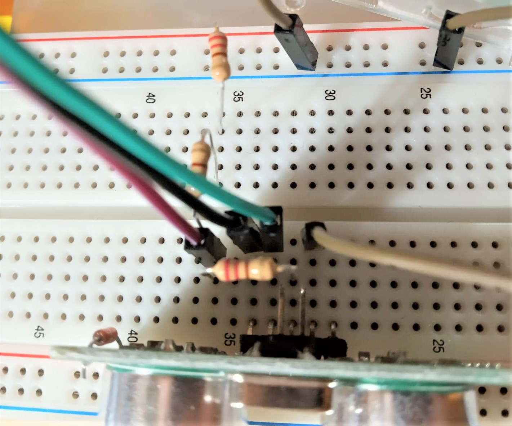

# IoT_car
## Inteoduction
This is a redio control car, which you can control it on your mobile phone 
### Features
1. A camera is set at the front of the car to stream the video on your phone, so you can see if there is any obstacle
2. A sensor can help you to stop automatically to avoid collision
3. You can control the speed of motors by slider on the web interface
### Prepare
- Car kit
- DC motor*4
- Camera
- Battery box*2
- Battery*8
- HC-SR04 Sensor
- L298N motor driver
- Dupont Line
- Breadboard
## Before Getting Start
The first thing to do is to install Flask on your Raspberry Pi. Go to Terminal and enter:
```python
sudo apt-get install python3-flask
```
Create a new folder to start your project
```
mkdir webapp
```
Go to the file you created, and new folders **templates** and **statics**
These two files must under the folder **webapp**
```
cd webapp
mkdir templates
mkdir statics
```
## Build up your Car
Click this link to learn how to build the car kit
 https://www.youtube.com/watch?v=uW8YVcBjPGU

## L298N motor driver
In order to control your motor, you need to use L298N
One motor driver can help us to control our motor in two parts. It depends on the way you connect Dupont Lines.
In this project, I devided four motors into left side and right side. It can make sure that this car can turn left or turn right
> Note: Make sure that wheels on the same side turn in the same direction

Click this link for more detail
https://www.youtube.com/watch?v=bNOlimnWZJE&list=PLc6fhBPeC6SBbZFcrHLlPXyR2svfxf1RZ&index=19&t=507s

## Sensor
Be careful that raspberry pi can only afford input 3.5V. However, sensor returns 5V input to raspberry pi, so make sure that you connect resistance on the breadboard to decrease the voltage.

> The way to connect resistance 


Define pins that are connected with sensor on the respberry pi
```
TRIG = 26
ECHO = 3
gpio.setup(TRIG, gpio.OUT)
gpio.setup(ECHO, gpio.IN)
```

We need to initiate the TRIG pin for ready to sensor 
> Before turn the signal *True* to *False*, stay for a millisecond
```
def distance():
    gpio.output(TRIG, True)
    time.sleep(0.00001)
    gpio.output(TRIG, False)
```

Calculate the time of distance with the formula
> **Distance = Time X 34300 / 2**

Return the result in the end of the function
```
    start = time.time()
    stop = time.time()

    while gpio.input(ECHO) == 0:
        start = time.time()
    while gpio.input(ECHO) == 1:
        stop = time.time()

    timeElapsed = stop - start
    distance = (timeElapsed*34300)/2
    print(distance)
    return distance
```

## Video Streaming

**testMotor2.py**
```
def gen(camera):
    """Video streaming generator function."""
    while True:
        frame = camera.get_frame()
        yield (b'--frame\r\n'
               b'Content-Type: image/jpeg\r\n\r\n' + frame + b'\r\n')


@app.route('/video_feed')
def video_feed():
    """Video streaming route. Put this in the src attribute of an img tag."""
    return Response(gen(Camera()),
                    mimetype='multipart/x-mixed-replace; boundary=frame')

```
The above script streams your camera video on an **index.html** page as below:
``` 

```
Click this link for more detail
https://www.instructables.com/id/Video-Streaming-Web-Server/
## Control wheels
Take an example of controlling the car go forward
#### index.html 
When press the image button, it pass a request to **testMotor2.py** and do the method **post**
```
<td>
  <form action="/forward" method="post">
     <input type="image" class="img" src="../statics/img/forward.png" />
  </form>
</td>
```
#### testMotor2.py

```
@app.route('/forward', methods=['GET', 'POST'])
```
The command line above connects html and python and do the function forward
```
def forward():
    init()
    while(distance() > 25):
        gpio.output(N1, False)  
        gpio.output(N2, True)
        gpio.output(N3, True)
        gpio.output(N4, False)
        time.sleep(0.5)

    stop()  //call stop function
    autoBack(0.5) // go backward for 0.5 second
    return render_template('index.html')
```

## PWM
Set up the pin on your respberry pi

**gpio.PWM ( pin, frequency )**
> Note: the higher frequency you give, the more smoothly they turn

```
N2 = 22
N3 = 23
gpio.setup(N2, gpio.OUT)
gpio.setup(N3, gpio.OUT)
pwm1 = gpio.PWM(N2, 100)
pwm2 = gpio.PWM(N3, 100)
```

Get the paremeter *speed* pass from the slider in index.html, and mulitply 10 to percentage
```
value = request.form['speed']
speed = int(value)*10  // the value of slider is 0~10
```

**start(0)** give pwm a initial speed   
**ChangeDutyCycle(speed)** change the speed of wheels
```
pwm1.start(0)
pwm1.ChangeDutyCycle(speed)
pwm2.start(0)
pwm2.ChangeDutyCycle(speed)
```
index.html
```
<div class="rangeSlider">
      <form action="/controlSpeed" method="post">
        <input
          type="range"
          name="speed"
          min="1"
          max="10"
          class="mySlider"
          id="sliderRange"
        />
        <p>Value: <span id="demo"></span></p>
        <input type="submit" value="ok" />
      </form>
</div>
```
## Final Product
Put all the function together and assemble your car, try to use tape to fixed those stuff together

